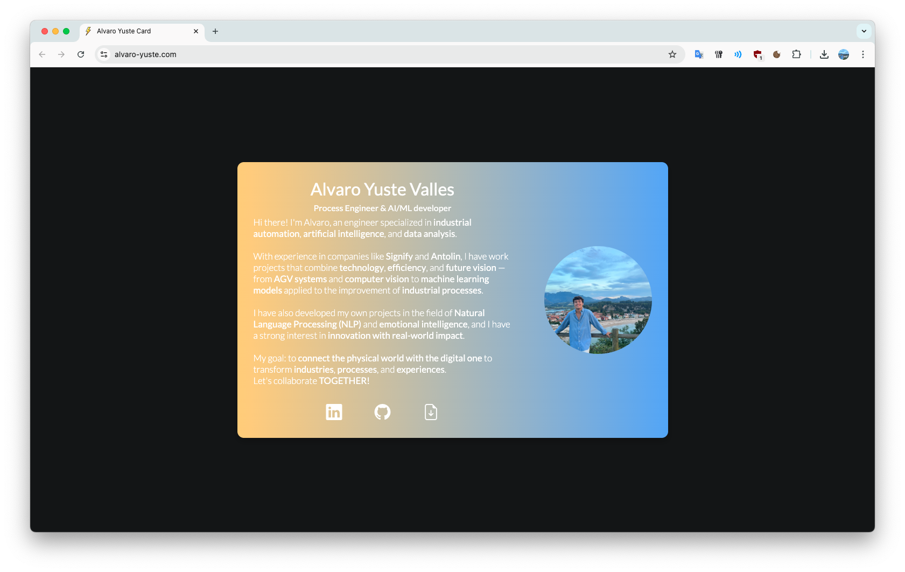

# My Personal Professional Card 

"Hi there!, I'm Alvaro Yuste. I hope you like my first personal card





<hr/>


## Deploy

[](https://personal-card-astro.netlify.app/)

## 🚀 Project Structure

Inside project, you'll see the following folders and files:

```text
public/
  ├── files/
  |      └── CV Alvaro Yuste Valles.pdf
  ├── images/
  |      └── profile2.webp
  ├── favicon.ico
src/
  ├── components/
  │     └── Card.astro
  ├── layouts/
  │     └── BaseLayout.astro
  ├── pages/
  │     └── index.astro
  ├── styles/
  │     ├── global.css
  │     └── card.css
```


## 👀 Want to know more about me?

[](https://www.linkedin.com/in/alvaro-yuste-valles)
